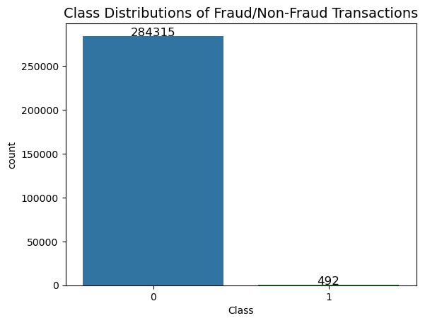
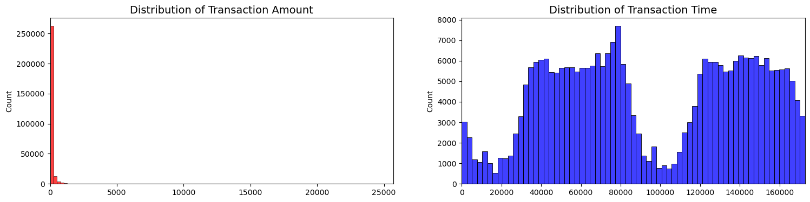
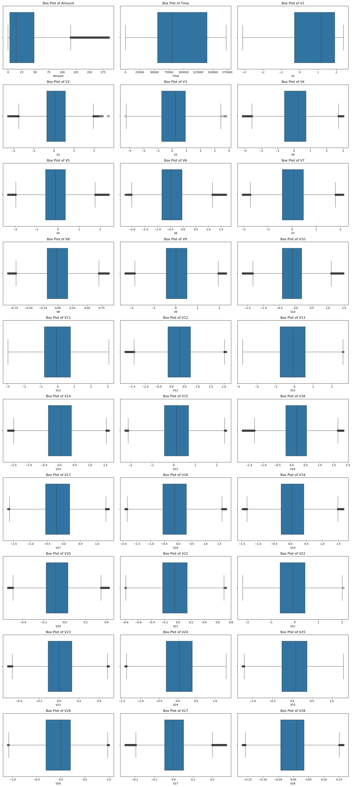

# PREDICTING CREDIT CARD FRAUD AGAIN
## Authors: Okky Rijanto, Sarita Rana, Elizabeth Yeo, Gibran Alvarez Aguilar, Gordon Geringas

### Summary
1. Data exploration

- There are no "Null" values in the dataset
- The transaction amount is small. The mean of all the transaction amounts is approx. $88.
- The dataset is highly imbalanced; 99.83% of the transactions were Non-Fraud while 0.17% of the transactions were fraud.
  
 

- The features other than "Amount" and "Time" have gone through a PCA transformation and were anonymized.

- Distributions:
  Visualizing the distributions of the "Transaction Time" and "Transaction Amount":

 

  Visualizing the distributions of all the features to check their skewness:
  
 
  
2. Data pre-processing

- Created box plots to visualize the outliers
  
 

- Removed outliers and duplicates
- Feature scaling: Since the other features have been scaled, we scaled the "Time" and "Amount" using StandardScaler.

### Machine Learning Architecture and Problem Domain motivation
   
Since the data is highly imbalanced, simpler models showed that, despite high accuracy, they did not perform well in fraud detection. Therefore, we explored multiple balancing techniques to improve the model's performance in detecting fraudulent transactions.

Pipelines Implemented:

Pipeline 1: Included SMOTE for data augmentation.

Pipeline 2: Used BalancedRandomForestClassifier, which incorporates an internal balancing mechanism.

Pipeline 3: Applied ADASYN for data augmentation.

Pipeline 4: Baseline model with stratified splitting of the dataset (ensuring the class distribution is maintained in both training and test sets).

Results:

Let's breakdown the Cross-validation results for the three pipelines (pipe1, pipe3, and pipe4) based on the accuracy, f1, and recall metrics.

Pipeline 1 (SMOTE):

Demonstrated a balanced performance with a focus on recall, which is crucial for detecting fraud cases.

1. Accuracy
   
Accuracy measures the proportion of correctly classified instances out of the total instances.

pipe1: array([0.99945138, 0.99947333, 0.99940749, 0.99949527, 0.99951722])

pipe3: array([0.99947333, 0.99945138, 0.99938555, 0.99956111, 0.99947333])

pipe4: array([0.99951722, 0.99945138, 0.99947333, 0.99956111, 0.99958305])

All three pipelines demonstrate very high accuracy, close to 1.0, indicating that almost all instances were classified correctly. The differences in accuracy across the pipelines are minimal, suggesting that each pipeline is highly effective in terms of correctly classifying instances overall.

2. F1 Score
   
The F1 score is the harmonic mean of precision and recall, giving a balanced measure of a model's performance on both the positive and negative classes.

pipe1: array([0.8427673, 0.83333333, 0.82352941, 0.84768212, 0.85714286])

pipe3: array([0.84810127, 0.82758621, 0.81578947, 0.86486486, 0.84615385])

pipe4: array([0.84722222, 0.81481481, 0.82857143, 0.86111111, 0.8707483])

The F1 scores vary more across the pipelines, reflecting how each handles the trade-off between precision and recall. pipe1 and pipe3 show relatively consistent F1 scores, while pipe4 shows a slight improvement, particularly in the higher end of the score range (up to 0.87). This suggests that pipe4 might be slightly better balanced in handling both true positives and minimizing false positives.

3. Recall

Recall (also known as sensitivity) measures the proportion of actual positives correctly identified by the model.

pipe1: array([0.85897436, 0.75949367, 0.79746835, 0.81012658, 0.83544304])

pipe3: array([0.85897436, 0.75949367, 0.78481013, 0.81012658, 0.83544304])

pipe4: array([0.78205128, 0.69620253, 0.73417722, 0.78481013, 0.81012658])

Recall scores show the greatest variation across the pipelines. pipe1 and pipe3 have similar recall scores, with pipe1 slightly better overall. However, pipe4 has lower recall scores, indicating it misses more actual positive cases compared to the other pipelines. This could mean that pipe4 is more conservative in its predictions, leading to fewer false positives but at the cost of more false negatives.

f1_score: 0.8842105263157894

 

Pipeline 2 (BalancedRandomForestClassifier):
Had the lowest accuracy among the pipelines, suggesting that its internal balancing mechanism may have affected its overall classification ability.

Pipeline 3 (ADASYN):
Showed similar trends to SMOTE but with a different synthetic data generation approach.

f1_score: 0.8645833333333334

 

Pipeline 4 (Stratified Split):
The stratified split helped maintain the class distribution during model training and testing, leading to the highest F1 score of 0.968. This indicates that careful data splitting without additional balancing techniques can be highly effective, especially when the model naturally handles class imbalance well.

f1_score: 0.968421052631579

 

Confusion matrices were plotted for each pipeline, highlighting the performance in terms of true positives, true negatives, false positives, and false negatives.
The confusion matrix for Pipeline 4 showed strong performance, with well-balanced precision and recall, further supported by the stratified data split.

Conclusion:
This analysis suggests that while all three pipelines are effective, pipe4 might be more precise but at the cost of missing some positive cases. If the goal is to minimize false negatives, pipe1 or pipe3 might be preferable. However, if minimizing false positives is more important, pipe4 might be the better choice.

Data balancing techniques like SMOTE and ADASYN generally improve the ability to detect fraud cases by enhancing recall. However, in this case, the baseline model with stratified data splitting outperformed others in terms of F1 score. This suggests that maintaining the natural distribution of classes during training can be more effective than applying synthetic data balancing, especially when using a model that handles class imbalance well.
Overall, pipeline 4 offers the best trade-off between accuracy, precision, and recall, ensuring that fraudulent transactions are detected efficiently without overwhelming the system with false positives.

### Data Augmentation with Autoencoders on Logistic Regression and Random Forest

For the Data Augmentation technique we used the deep_tubular_augmentation package made by the blogger lschmiddey, this package uses deep learning Autoencoders Autoencoders to statistically create a synthethic or "augmented" dataset to feed other ML or DL models. We used this technice to balance the dataset from section "1. Data exploration" of this file, the DL model created synthethic fraud datapoints that are statistically similar to the original fraud data. 

In the following graphic you can see how the synthetic data on the bottom left resembles in shape to the original fraud datapoint on the top right.

We then mixed this new synthetic data with our original one to train and fit First a Logistic Regresion model, and second a Random Forest model we then compraed them respectively with models trained without synthetic data, the results are shown below.

Logistic Regression Original Data

Accuracy: 0.9985487400957364
F1 score : 1.5466666667

Logistic Regression  Synthetic Data

Accuracy: 0.9993797034280163
F1 score : 0.8140350877192982

Random Forest Original Data

Accuracy: 0.9985253326779256
F1 score : 1.5263157895

Random Forest  Synthetic Data

Accuracy: 0.9991456292499094
F1 score : 0.7574750830564784

7. XG Boost (Okky)

Credit Card Fraud Detection using XGBoost with SMOTE

Project Overview

This project focuses on detecting fraudulent credit card transactions using advanced machine learning techniques. It utilizes the XGBoost algorithm combined with SMOTE (Synthetic Minority Over-sampling Technique) to address the challenge of class imbalance typically found in fraud detection datasets. The project includes data preprocessing, model building, evaluation, and a series of visualizations to aid in understanding the data and model performance.

Project Structure

1.	Data Preprocessing:
o	The project begins with loading and preprocessing the dataset. This includes tasks such as cleaning the data, handling missing values, scaling features, and preparing the data for model training by splitting it into training and testing sets.
2.	Class Imbalance Handling with SMOTE:
o	Due to the inherent class imbalance in fraud detection, where fraudulent transactions are rare, SMOTE is applied to oversample the minority class. This technique helps the model to learn effectively from both classes and avoid bias towards the majority class.
3.	Model Development with XGBoost:
o	The project leverages XGBoost, a powerful gradient boosting algorithm known for its efficiency and accuracy. The model is trained with careful hyperparameter tuning to optimize its performance on the given dataset.
4.	Model Evaluation and Validation:
o	Comprehensive evaluation of the model is carried out using metrics such as Accuracy, Precision, Recall, F1-Score, and ROC-AUC. These metrics provide insight into the model's performance and its ability to correctly identify fraudulent transactions.
o	Visual tools like the Confusion Matrix and ROC Curve are used to further validate the model’s predictions.

Results and Insights

Accuracy: 0.999385555282469

Precision: 0.8118811881188119

Recall: 0.8367346938775511

F1 Score: 0.8241206030150754

Confusion Matrix:
[[56845    19]
 [   16    82]]

The model developed in this project effectively detects fraudulent transactions, with the integration of SMOTE significantly enhancing its performance by ensuring balanced learning. The evaluation metrics indicate strong model performance, particularly in terms of Recall, which is crucial for identifying fraud.
Key Results:
•	High Accuracy in detecting fraudulent transactions while maintaining a balance with false positives.
•	Improved Recall due to the application of SMOTE, ensuring that most fraudulent cases are captured.
•	ROC-AUC Score demonstrating the model's ability to distinguish between fraudulent and non-fraudulent transactions effectively.

Conclusion

The application of XGBoost in this project has proven effective for handling complex datasets, particularly in managing the class imbalance inherent in credit card fraud detection. By leveraging SMOTE to oversample the minority class, the model is better equipped to identify fraudulent transactions, which is crucial for accurate fraud detection.

While the model achieved an impressive accuracy of 0.999, the F1 score of 0.82 suggests there is room for improvement in balancing false positives and false negatives. To further enhance the model's performance and ensure it generalizes well:

Hyperparameter Tuning and Cross-Validation: These techniques should be employed to optimize the model and prevent overfitting, potentially improving the balance between Precision and Recall.
Adjusting the Random State: Experimenting with different random state values has shown potential to increase the F1 score, indicating a better trade-off between false positives and false negatives.
By focusing on these strategies, the model’s effectiveness in real-world fraud detection scenarios can be significantly enhanced.

9. GAN

Generative Adversarial Netowkr (GAN) was implemented to generate synthetic fraudulent transactions to balance the dataset. The GAN model learns the distribution of fraudulent transactions and generates realistic samples. It composes of 2 elements: the discriminator and the generator.
The key challenge was to maintain the conditional relationships between features while addressing the data imbalance. We also conducted extensive experiments with and without early stopping to observe how training impacts the model’s discriminator and generator performance.

Early stopping appears to have resulted in a more balanced training, whereas training without early stopping allowed the generator to overpower the discriminator, potentially leading to a less effective overall model. It's essential to monitor both D and G losses and consider using techniques like early stopping, regularization, or adaptive learning rates to maintain the balance between the two networks during training.

 

### Conclusion

From this analysis we concluded that data augmentation through autoencoders is a good alternative to deal with unbalanced datasets given the application of data augmentation significantly improved the model's ability to detect fraudulent transactions. Models trained with augmented data demonstrated higher accuracy, and better F1 scores compared to those trained on original datasets. This suggests that data augmentation is a viable strategy for addressing the class imbalance and improving model generalization.

The GAN approach showed potential but struggled with maintaining stability during training, as seen in fluctuating discriminator accuracy.
The pipelines using SMOTE and ADASYN provided consistently high accuracy and F1 scores, with results close to 100% in our test sets. However, the stratified approach yielded better recall, which is critical in fraud detection as accuracy is not the best metric for imbalanced datasets.
After evaluating our pipelines, the stratified approach was chosen as the most reliable for minimizing false negatives while maintaining high precision.
The Logistic model also has a good performance as it has the highest F1 Score of 0.81

### Limitations:
We faced GPU capacity limitations while implementing all of the methods. In the future, we would like to run the models on a cloud solution and try implementing a more fine tuned GAN model.

### Criteria
We seek to train a model that minimizes [true fraud:predicted notfraud] and maximizes [truefraud : predicted fraud]. Undetected true fraud is strictly damaging to the financial health of the credit institution and clients. Predicting true fraud allows the institution to mitigate harms of fraud by locking the card out of any further transactions. To that extent, we seek a model that can perform better than 1:3 [true fraud:predicted notfraud] : [truefraud : predicted fraud].

### Individual Reflection Videos
* Okky Rijanto https://drive.google.com/file/d/11cscCL---6xCpPFqdsMAAuUsQiC7jOlX/view?usp=sharing
* Sarita Rana https://drive.google.com/file/d/1BRG57RgI38FPcXfEGbGufJUJm2n22Snj/view?usp=drive_link
* Elizabeth Yeo https://drive.google.com/file/d/15_0BX8GfHM5OLTYdSAx6ccOuoLX-YPIK/view?usp=drive_link
* Gibran Alvarez Aguilar https://youtu.be/om97Yn7_cks?si=ANkwDVrNHaUa_hbd
* Gordon Geringas

### Repo File and Folder Structures
* **Data:** Contains the raw, processed and final data. For any data living in a database, make sure to export the tables out into the `sql` folder, so it can be used by anyone else.
* **Experiments:** A folder for experiments
* **Models:** A folder containing trained models or model predictions
* **Reports:** Generated HTML, PDF etc. of your report
* **src:** Project source code
* README: This file!
* .gitignore: Files to exclude from this folder, specified by the Technical Facilitator

### Change log
2024-08-07 [Gordon] Added team-project-2 branch and set up README.md
